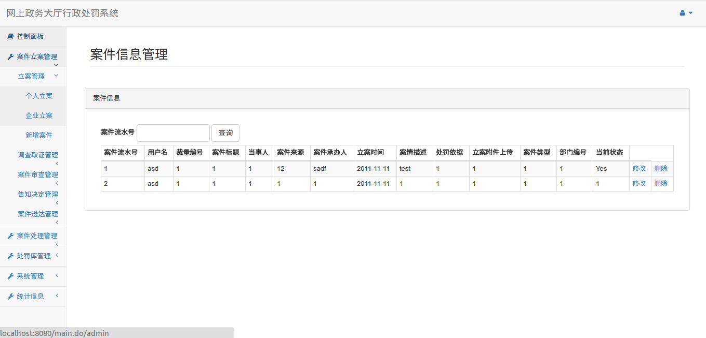

# 简介
这是个简单的在线行政处罚系统，改编自教务系统，实现了[论文](http://cdmd.cnki.com.cn/Article/CDMD-10422-1015375070.htm)的大部分功能。

# 使用技术 

IoC容器:spring

web框架:springmvc

orm框架:mybatis

安全框架:shiro

数据源:dbcp2

日志: sl4j

Json: Gson

前端框架:Bootstrap

# 起步:

1.初始化项目

1)下载Mysql,创建一个数据库名字为giit,导入giit.sql,直接运行其中sql即可

2)下载Tomcat8.5

3)使用Intellij Idea导入项目,之后配置项目启动方式,使用刚才下载好的Tomcat

4)运行

# 使用简介:

1.权限介绍:

根据导入的populate.sql,运行网站初始时会存在四个权限角色:

1).政府工作人员,账号为admin

2).个人用户，帐号为individual

*密码均为123456*

# 功能介绍:
对数据库中案件表，业务表，处罚表等的增删改查功能。以及可视化的展示功能。

